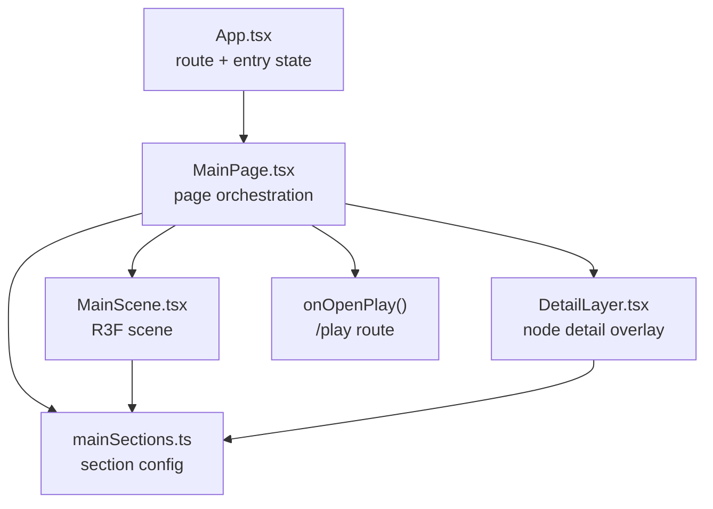

# Main Page Split Design

> 本文档定义 Sakura1Tap 主页面拆分的整体设计。  
> 目标是先建立稳定系统边界，再逐步处理局部优化。

## 1. 设计目标

主页面拆分不是为了追求文件数量，而是为了让系统更容易维护。

目标：

- 内容数据可维护：改文案、节点、热点和镜头时，不进入渲染逻辑。
- 场景逻辑可维护：改 Three.js / R3F / GLB / 粒子时，不影响页面 DOM。
- 页面交互可维护：滚轮、热点、主面板和详情层的状态集中在清晰位置。
- 后续多 agent 可协作：每个任务能分配明确文件边界。
- 保持当前视觉和交互身份：Live2D + 3D + Play 的沉浸式个人网站，不变成普通模板站。

非目标：

- 本阶段不重写视觉设计。
- 本阶段不替换路由方案。
- 本阶段不改 Vite chunk 配置。
- 本阶段不拆 Live2D 内部实现。
- 本阶段不做 CSS 大规模迁移。

## 2. 当前主页面模块边界



### `src/data/mainSections.ts`

职责：

- 定义 `SectionKey`。
- 保存 About / Work / Source / Play 的内容和配置。
- 保存主题色、热点位置、镜头位置、模型旋转、详情卡片和图标。
- 导出稳定的 `sectionOrder`。

不负责：

- React 状态。
- DOM 渲染。
- Three.js 渲染。
- 路由跳转。

### `src/components/MainPage.tsx`

职责：

- 管理当前 active 节点。
- 管理详情层打开状态。
- 管理滚轮切换节奏。
- 管理光标位置 CSS 变量。
- 渲染主页面 DOM 骨架。
- 组合 `MainScene`、`DetailLayer`、节点按钮、主面板和技术条。
- 在 Play 节点触发 `onOpenPlay`。

不负责：

- 直接写 section 配置。
- 直接写 R3F / Three.js / GLTFLoader 逻辑。
- 直接写详情卡片内部结构。
- 处理 App 路由状态。

### `src/components/main/MainScene.tsx`

职责：

- 渲染 R3F `Canvas`。
- 管理镜头缓动 `SceneRig`。
- 解析并渲染主 GLB 模型 `MainStudyModel`。
- 渲染能量环和粒子 `EnergyField`。
- 响应 active section 的 camera、orbit、modelRotation 和 accent。

不负责：

- 主页面 DOM。
- 节点详情。
- Play 路由。
- 文案内容编辑。

### `src/components/main/DetailLayer.tsx`

职责：

- 读取当前节点详情数据。
- 渲染详情标题、关闭按钮、详情卡片。
- 保持详情层动画参数和 CSS 类名。

不负责：

- 管理详情打开状态。
- 管理当前 active 节点。
- 管理滚轮或热点切换。

## 3. 目标结构

当前已达到的结构：

```text
src/
├─ data/
│  └─ mainSections.ts
└─ components/
   ├─ MainPage.tsx
   └─ main/
      ├─ MainScene.tsx
      ├─ DetailLayer.tsx
      ├─ MainPanel.tsx
      ├─ MainNodeMap.tsx
      ├─ SceneHotspots.tsx
      └─ TechStrip.tsx
```

建议的下一阶段目标结构：

```text
src/
├─ data/
│  └─ mainSections.ts
└─ components/
   ├─ MainPage.tsx
   └─ main/
      ├─ DetailLayer.tsx
      ├─ MainNodeMap.tsx
      ├─ MainPanel.tsx
      ├─ SceneHotspots.tsx
      ├─ MainScene.tsx
      └─ TechStrip.tsx
```

暂不建议立即创建太多文件。只有当某个组件具备独立职责和清晰 props 时，再拆。

## 4. 分阶段计划

### Phase 0：基线整理

状态：done

完成项：

- 清理旧版 Play 残留。
- 建立 `WORKFLOW.md` 和 `BACKLOG.md`。
- 同步 `_redirects` 当前事实。

验收：

- `npm run build` 通过。
- Play 独立路由保留。
- 文档不再描述过期事实。

### Phase 1：内容和场景拆分

状态：done

完成项：

- 抽离 `mainSections.ts`。
- 抽离 `MainScene.tsx`。
- 抽离 `DetailLayer.tsx`。

验收：

- 主页面视觉不变。
- 节点切换不变。
- 详情层打开/关闭不变。
- 3D 模型仍使用 Boot 传入的 GLB buffer。
- `npm run build` 通过。

### Phase 2：DOM 子组件拆分

状态：done

候选任务：

1. 拆 `MainPanel.tsx`
   - 主面板标题、正文、按钮。
   - 需要接收 active section、是否 Play 节点、打开节点回调。
   - 状态：done。

2. 拆 `MainNodeMap.tsx`
   - 节点按钮和图标。
   - 需要接收 active、sectionOrder、activateSection。
   - 状态：done。

3. 拆 `SceneHotspots.tsx`
   - 场景热点按钮。
   - 需要接收 active、activateSection。
   - 状态：done。

4. 拆 `TechStrip.tsx`
   - 底部技术条。
   - 如果内容长期固定，可以最后再拆。
   - 状态：done。

建议顺序：

1. `MainPanel`
2. `MainNodeMap`
3. `SceneHotspots`
4. `TechStrip`

原因：

- `MainPanel` 是最明显的内容展示边界。
- `MainNodeMap` 和 `SceneHotspots` 都是导航入口，可以后续考虑合并成一个导航模型。
- `TechStrip` 现在很小，不急。

### Phase 3：历史组件审计

状态：done

候选文件：

- `src/components/EntryScene.tsx`
- `src/components/EntryControls.tsx`
- `src/components/EnterOverlay.tsx`
- `src/components/Live2DCharacter.tsx`
- `src/components/StudyModel.tsx`

目标：

- 判断它们是否仍被活流程使用。
- 如果不用，决定删除、归档到实验目录，或保留并写说明。

验收：

- 每个历史组件都有明确结论。
- 不删除可能用于回滚的重要参考，除非确认无价值。

结果：

- 审计结论记录在 `docs/HISTORICAL_COMPONENT_AUDIT.md`。
- 未引用旧入口组件已删除。

### Phase 3.5：功能规格目录

状态：done

完成项：

- 新增 `docs/specs/README.md`。
- 新增 `docs/specs/SPEC_TEMPLATE.md`。

目标：

- 后续新功能先写规格，再进入代码实现。
- 避免主页面拆分结束后又回到随机 coding。

### Phase 4：样式模块化

状态：later

建议拆分：

```text
src/styles/base.css
src/styles/boot.css
src/styles/entry.css
src/styles/main.css
src/styles/play.css
src/styles/responsive.css
```

暂缓原因：

- `style.css` 虽然大，但视觉耦合强。
- CSS 拆分容易产生移动端或入口页回归。
- 应先完成组件边界，再按组件边界迁移样式。

### Phase 5：性能和 bundle 优化

状态：later

问题：

- `MainPage` chunk 仍超过 500 kB。
- 当前拆分改善维护性，但没有改变静态 import 图。

候选方案：

1. 对 `MainScene` 做二级 lazy。
2. 添加 bundle analyzer 后再决定是否优化 chunk。
3. 只在证据明确时考虑 Vite `manualChunks`。

暂缓原因：

- 之前构建优化曾带来白屏风险。
- 现在首要目标是系统边界，不是先调 bundle。

## 5. 设计决策

### Decision 1：先拆数据，再拆场景

原因：

- 数据最容易独立。
- 抽离后未来内容维护风险最低。
- 不影响运行时行为。

### Decision 2：R3F 场景保持一个文件

原因：

- `SceneRig`、`MainStudyModel`、`EnergyField` 都依赖 Canvas 上下文。
- 先集中在 `MainScene.tsx`，比立刻拆成多个 R3F 文件更安全。
- 后续如果 `MainScene.tsx` 超过 300 行，再继续拆内部场景子组件。

### Decision 3：`AnimatePresence` 留在父层

原因：

- 详情层是否挂载由 `MainPage.tsx` 控制。
- 父层保留挂载边界，可以避免动画行为改变。
- `DetailLayer` 只负责弹层内部结构。

### Decision 4：暂不拆 CSS

原因：

- CSS 牵涉 Boot、Entry、Main、Play 多个体验层。
- 现在组件边界还在整理，先拆 CSS 会增加回归面。
- 等 DOM 子组件稳定后，再按模块迁移样式更稳。

## 6. Multi-Agent 分工建议

适合并行：

- Archivist：更新日志、backlog、设计文档。
- Builder：按明确文件边界拆一个组件。
- Keeper：检查构建、路由、入口流程和文档事实。

不适合并行：

- 多个 Builder 同时改 `MainPage.tsx`。
- 一个 Builder 拆组件，另一个 Builder 同时拆 CSS。
- 未设计清楚时直接改 Vite 配置。

推荐口令：

```text
用 multi-agent 继续主页面拆分：
Builder 只负责 MainNodeMap.tsx，从 MainPage.tsx 移出节点导航 DOM。
Archivist 只负责更新 MAIN_PAGE_SPLIT_LOG.md、BACKLOG.md、CHANGELOG.md。
Keeper 检查是否影响 Boot -> Live2D -> Main -> Play 和 npm run build。
```

## 7. 验收标准

每一刀拆分必须满足：

- `npm run build` 通过。
- 主流程不变：Boot -> Live2D -> Main -> Play。
- `/play` 和 `/play/blackout` 不被影响。
- 文件职责更清楚，不只是机械搬代码。
- 文档同步更新。
- 没有新增依赖。
- 没有新增外部脚本或素材。

## 8. 执行流程

后续主页面拆分按这个流程执行。除非用户明确要求跳过，否则不要直接从代码开始。

### Step 1：选择一个拆分目标

从本文档的阶段计划或 `docs/BACKLOG.md` 中选择一个任务。

要求：

- 任务必须能用一句话说明。
- 任务必须有明确文件边界。
- 一次只处理一个拆分目标。

示例：

```text
拆 MainNodeMap.tsx，只移动节点导航 DOM，不改文案、不改样式。
```

### Step 2：确认边界

动手前先写清楚：

- 要改哪些文件。
- 不改哪些文件。
- 哪些行为必须保持不变。
- 可能的回归风险。

主页面拆分默认不改：

- Boot -> Live2D -> Main -> Play 流程。
- `/play` 和 `/play/blackout` 路由。
- 视觉参数、CSS 类名和动画参数。
- Vite 配置和依赖。

### Step 3：执行最小代码移动

Builder 只做必要移动。

规则：

- 优先搬已有代码，不顺手重写。
- 保持 props 简单。
- 子组件只拿自己需要的数据和回调。
- 不把父组件状态拆散到多个组件里，除非有明确设计理由。
- 如果出现“顺便优化”的念头，先写到 backlog。

### Step 4：验证

每次代码拆分后运行：

```bash
npm run build
```

需要人工检查时，至少检查：

- 首页入口仍能进入主页面。
- 滚轮切换节点仍正常。
- 热点和节点按钮仍正常。
- `OPEN NODE` / 关闭详情仍正常。
- Play 节点仍能进入 Play Toolbox。

### Step 5：记录

每次完成后同步更新：

- `docs/MAIN_PAGE_SPLIT_LOG.md`
- `docs/CHANGELOG.md`
- `docs/BACKLOG.md`

如果文件结构变化，还要同步：

- `docs/PROJECT_OVERVIEW.md`
- `README.md`
- `AGENTS.md`

记录必须包含：

- 改了什么。
- 为什么这样拆。
- 验证结果。
- 下一步建议。

### Step 6：停下来判断

每一刀完成后先判断，不自动连续拆。

判断问题：

- 这个拆分是否真的降低复杂度？
- 下一个任务是否仍然边界清楚？
- 是否已经该先做视觉/内容设计，而不是继续拆代码？
- 是否需要 Keeper 做风险检查？

如果答案不清楚，先更新文档或询问用户。

## 9. 下一步建议

推荐下一步：

1. 进入需求设计。
2. 再考虑 CSS 模块化或 bundle 优化。

暂不推荐：

- 立刻拆 `style.css`。
- 立刻改 `manualChunks`。
- 立刻引入 React Router。
- 立刻引入新 UI 框架。

总判断：

主页面拆分已经进入“整体架构成型”阶段。后续应该围绕模块边界继续推进，而不是根据行数随意拆。
