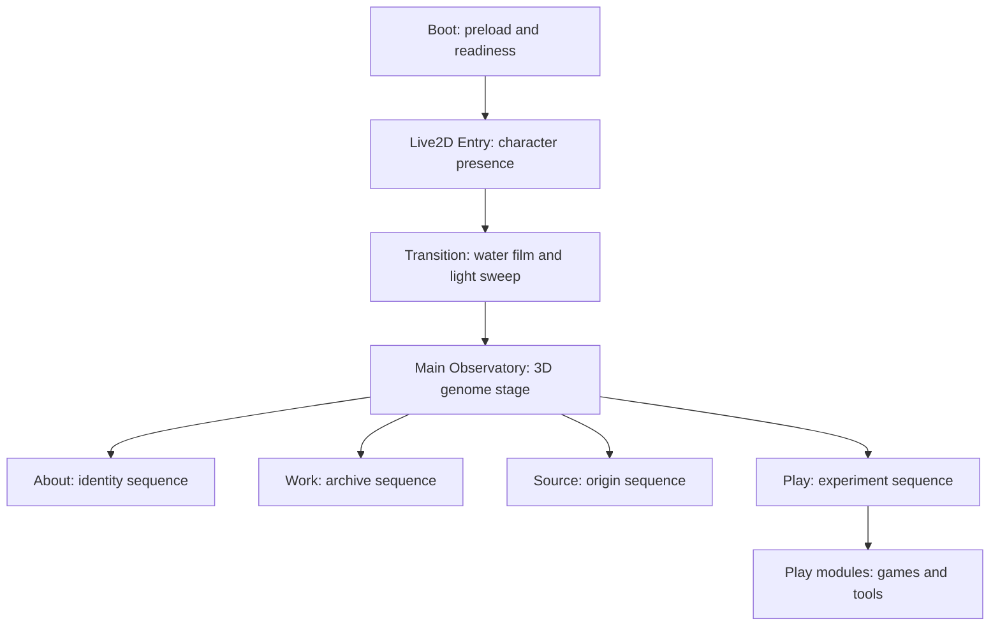

# Black Sakura Genome Observatory Frontend Design

> 本文档是 Sakura1Tap 下一轮前端页面设计的系统方案。  
> 它整合 GSAP、React Three Fiber、Live2D、现有主页面拆分结果和候选素材库，目标是做出兼容性强、维护性强、后续扩展性好的前端体验。

## 1. Summary

- Title: Black Sakura Genome Observatory / 黑樱基因观测站
- Status: draft
- Owner role: Designer / Builder / Keeper / Archivist
- Layer: Entry / Main Scene / Motion / Assets / Performance
- Created: 2026-07-01
- Related specs:
  - `docs/specs/FRONTEND_REDESIGN_GSAP_3D_MOTION.md`
  - `docs/ASSET_LIBRARY.md`
  - `docs/MAIN_PAGE_SPLIT_DESIGN.md`

## 2. Design Thesis

Sakura1Tap 不应该变成普通赛博朋克模板，也不应该只堆动漫模型和粒子。

本轮设计把网站定义成：

> 一个黑色纸面、水墨岩层、透明水膜和基因全息结构组成的个人实验站。Live2D 是入口守门人，3D 主页面是观测舱，About / Work / Source / Play 是四个可探索的基因节点。

核心关键词：

- 黑色主基调
- 樱花但不甜腻
- DNA / genome / sequence
- 水墨 / 岩石 / 纸面
- 赛博冷光
- Live2D presence
- 轻量但有层次的 GSAP motion

## 3. Experience Architecture



用户体验顺序：

1. Boot 加载背景、Live2D 和主模型资源，不增加新的重资源阻塞。
2. Live2D Entry 保留为第一印象，角色像“入口守门人”。
3. 进入主页面时，水膜/光扫过，场景从入口过渡到观测舱。
4. 主页面中心出现 DNA / 当前 3D 模型 / 能量环的组合舞台。
5. 四个节点不再只是菜单，而是四段“序列”。
6. 打开详情层时，资料像实验报告浮出水面。
7. Play 作为实验室，不和主页面抢首屏重量。

## 4. Asset Strategy

素材不是越多越好。它们应该进入明确角色。

| Role | Asset source | Usage | Loading tier |
| --- | --- | --- | --- |
| Identity guardian | Current Live2D models | Entry stage, emotional first impression | Entry only |
| Genome core | `素材库/dna_hologram.glb` or procedural DNA | Main scene motif, Source/identity transition | Main optional |
| Black matter | `dark_rock_4k.blend.zip` extracted textures | Ground/base/material feel | Texture optimized |
| Night light | `rogland_clear_night_4k.exr` reduced version | Environment lighting | Lazy / low-res |
| Ritual accent | `chinese_chandelier_4k.blend.zip` | Later Source/Entry visual accent | Future |
| Archive artifact | `gothic_statue_4k.blend.zip` | Future Source/Work archive room | Future |
| Sakura signal | Procedural petals, not 77MB full model | Motion particles and node transition | Lightweight |
| Anime models | Existing candidate GLBs | Reference or private experiment only | License-check |
| Creator hand | `2d_hand_creation_rigged.glb` | Later Work/Play interaction | Future |

Primary rule:

- 本阶段只把 DNA、黑色材质、低成本花瓣/水波纳入主页面设计。
- Live2D 保留在 Entry，不急着搬进 Main Scene。
- 角色类模型必须先查授权，不作为公开首版资源。

## 5. Page System

### Entry: Live2D Gate

功能定位：

- 建立角色存在感。
- 承接 Boot 加载。
- 用进入按钮触发主页面转场。

视觉策略：

- 背景继续保留幻想路，但后续可加入更暗的纸面/水膜遮罩。
- Live2D 不做“贴纸”，而是入口里的主角。
- 进入时让角色、粒子和水膜一起完成淡出，而不是硬切。

技术边界：

- 不重写 `Live2DStage` 和 `CubismSdkModel`。
- GSAP 只控制 Entry DOM、遮罩、粒子层、转场层。
- Live2D 加载失败仍允许用户进入，不阻塞主流程。

### Main: Genome Observatory

功能定位：

- 网站主舞台。
- 以 3D 空间承载四个节点。
- 通过 GSAP 时间线把 UI、光、波纹和节点切换编排起来。

主视觉结构：

```text
background paper / dark field
  ↓
ripple and ink film
  ↓
R3F scene: current model + optional DNA hologram + energy field
  ↓
hotspots / node map
  ↓
panel and detail report
```

四节点命名语义：

- About: Identity Sequence
- Work: Archive Sequence
- Source: Origin Sequence
- Play: Experiment Sequence

### Source: Asset and Origin Archive

Source 节点后续应承担两个职责：

- 对外展示素材、模型、灵感和许可证说明。
- 对内作为设计演化记录入口。

这里适合放：

- DNA hologram 的来源/生成说明。
- `study.glb` attribution。
- Poly Haven / Sketchfab / 自制程序化素材说明。
- 后续水墨、岩石、HDRI 的来源。

### Play: Experiment Lab

Play 不只是小游戏入口，而是未来的互动实验室。

可扩展方向：

- Blackout Run 保留。
- DNA interaction toy：拖动/旋转双螺旋。
- Ripple lab：测试水波、墨迹和 pointer effects。
- Asset viewer：查看素材如何进入网站视觉系统。

## 6. Module Design

采用深模块思路：让复杂实现藏在小 interface 后面，避免 MainPage 再次膨胀。

### Motion Module

Seam:

```text
src/motion/
```

Interface:

- `gsap.ts`: register/export GSAP and `useGSAP`.
- `motionTokens.ts`: shared duration/ease/query values.
- future `mainMotion.ts`: build and control main page timelines.

Implementation hidden inside:

- timeline labels
- reduced-motion behavior
- section transition choreography
- input lock timing
- ripple trigger timing

### Asset Module

Seam:

```text
src/assets/ or src/data/assets.ts
```

Interface should eventually expose:

- asset id
- public url
- type
- loading tier
- license status
- intended layer

Do not scatter raw asset paths across components.

### Scene Module

Seam:

```text
src/components/main/MainScene.tsx
```

Interface:

- `active`
- `modelBuffer`
- `nodeOpen`
- future `visualMode`
- future `enabledMotifs`

Implementation hidden inside:

- camera damping
- lighting
- fog
- optional DNA model
- optional environment map
- particle counts

### Entry Module

Seam:

```text
src/components/Live2DEntry.tsx
src/components/Live2DStage.tsx
```

Interface should stay small:

- readiness
- enter callback
- ready change callback

Do not expose Live2D internals to the main page.

## 7. GSAP Motion System

GSAP should control coordinated DOM motion, not replace React or R3F.

Core rules:

- Use `useGSAP({ scope })` for React components.
- Use timeline labels: `idle`, `leave`, `transit`, `enter`, `detail`.
- Use `autoAlpha`, `x`, `y`, `scale`, `rotation`, CSS variables.
- Use `gsap.quickTo()` for pointer-following values.
- Use `gsap.matchMedia()` for desktop/mobile/reduced-motion.
- Do not animate layout-heavy properties like width, height, top, left.
- Do not create tweens in pointer handlers without `contextSafe` or reusable setters.

Main timeline:

```text
idle
  -> leave current sequence
  -> ripple sweep
  -> scene target changes
  -> enter next sequence
  -> idle
```

Detail timeline:

```text
node idle
  -> depth push
  -> report surface rise
  -> card stagger
  -> reading mode
```

Entry-to-main timeline:

```text
entry ready
  -> button intent
  -> Live2D stage fades
  -> water film closes
  -> main scene reveals
```

## 8. Compatibility Strategy

三个体验等级：

### Tier A: Full

条件：

- desktop
- WebGL available
- no reduced-motion
- acceptable device performance

启用：

- R3F main scene
- DNA hologram if optimized
- ripple layer
- GSAP section timeline
- environment light

### Tier B: Balanced

条件：

- mobile or medium device

启用：

- R3F scene
- simpler ripple
- fewer particles
- no heavy HDRI
- shorter transitions

### Tier C: Fallback

条件：

- WebGL unavailable
- reduced-motion
- model load failed

启用：

- static dark/paper background
- section UI
- minimal fade/opacity
- no continuous ripple
- clear model offline status

This preserves the site as a website first, spectacle second.

## 9. Visual System

Palette direction:

- Base: near black, ink black, warm paper black.
- Accent: cold cyan for DNA, soft pink for sakura, warm amber for archive light.
- Avoid: broad purple-blue gradients, generic neon panels, one-note cyber palette.

Material direction:

- Black rock: depth and surface.
- Paper grain: readable warmth.
- Water film: interaction feedback.
- Hologram line: DNA/science motif.
- Sakura particle: identity hint, not decoration spam.

Typography and UI:

- Keep compact, sharp, readable.
- Panels should feel like floating lab reports, not marketing cards.
- Node labels can use sequence language, but copy should not become jargon soup.

## 10. Implementation Phases

### Phase 0: Asset and License Audit

- Status: started on 2026-07-01.
- Complete `docs/ASSET_LIBRARY.md`.
- Mark active/candidate/license-check/blocked.
- Do not move heavy assets into production paths yet.
- Added `src/assets/assetManifest.ts` as the first runtime interface for active and candidate assets.

### Phase 1: Main Motion Shell

- Status: started on 2026-07-01.
- Use existing `src/motion/gsap.ts` and `motionTokens.ts`.
- Add a scoped motion layer around main page DOM.
- Implement section transition labels without changing visuals drastically.
- Added `src/components/main/MainMotionLayer.tsx` and wrapped the main page scene/UI stack.
- Added lightweight ink film and scan layers controlled by GSAP CSS variables.
- `npm run build` passed after this slice.
- Split GSAP runtime control into lazy `src/components/main/MainMotionController.tsx`.
- `MainMotionLayer` now renders immediately, while `MainMotionController` downloads as a separate chunk.
- Build result after lazy split: `MainMotionController` is about 72 kB, and `MainPage` returns to about 943 kB.
- Known performance note: `MainPage` is still over 500 kB because the R3F/Three scene is heavy. Treat scene/model code splitting as a future performance task.
- Expanded on 2026-07-01 with a stronger GSAP timeline: node map, panel, tech strip, wheel rail, hotspots, scan layer, and surface variables now animate as one coordinated sequence.
- Updated after visual critique: the old visible shell was still too close to the previous framework. Added `GenomeInterface` as the new first-screen interaction layer: central sequence orbit, large wordmark, briefing rail, and bottom data rail.
- `MainPage` now uses `GenomeInterface` instead of the old `SceneHotspots` + `MainNodeMap` + `MainPanel` visual composition.
- Updated after architecture critique: `MainPage` is now only a thin adapter. `MainExperience` owns the new experience Shell, `experienceMachine` owns sequence state, and `GenomeStage` lazy-loads the R3F/Three stage.
- Build result after this split: `MainPage` drops to about 11.64 kB, while the heavy 3D implementation moves into lazy `GenomeStage`.

### Phase 2: Ripple / Ink Film

- Add lightweight ripple layer.
- Start with CSS/canvas overlay.
- Use pointer quick setters.
- Add reduced-motion fallback.

### Phase 3: Genome Motif

- Status: started on 2026-07-01.
- Evaluate `dna_hologram.glb`.
- If too heavy, build procedural DNA in R3F.
- Add only after main motion is stable.
- Added a lightweight procedural `GenomeMotif` inside `MainScene` instead of loading `素材库/dna_hologram.glb` into the first visual slice.
- Updated after feedback: copied `素材库/dna_hologram.glb` to `public/art/models/dna_hologram.glb` and added lazy `DnaHologram` loading in `MainScene`.
- The procedural `GenomeMotif` now acts as a fallback while the real GLB downloads.

### Phase 4: Material and Lighting

- Status: started on 2026-07-01.
- Extract low-res dark rock textures.
- Evaluate low-res night environment.
- Tune lighting so 3D looks intentional but not heavy.
- Added an `ObsidianBase` and dark/cold lighting pass in R3F as a no-heavy-asset interpretation of the dark rock / black material direction.
- Updated after feedback: added a night environment wash, stronger cyan/pink spot lights, warmer directional key light, and darker rough/metallic obsidian base material.
- `rogland_clear_night_4k.exr` remains a conversion source, not a runtime asset, because the original file is about 97 MB.

### Phase 5: Source Archive

- Turn Source into a proper origin/archive node.
- Show asset/license/design evolution.
- Link to asset notes.

### Phase 6: Entry Theatre

- Status: started on 2026-07-01.
- Enhance Live2D entry transition.
- Keep Live2D internals untouched.
- Add water film close/open transition into main scene.
- Added Boot genome field, double orbit, helix nodes, progress readout, and darker genome boot styling.
- Added `BootMotionController` as a lazy GSAP enhancement for Boot intro/stagger/scan/progress-swell motion.
- Added Live2D entry observatory rings and Identity / Archive / Origin / Experiment sequence stack.
- Added `EntryMotionController` as a lazy GSAP enhancement for Entry intro/stagger/scan/ready/enter motion.
- Current limitation: this phase now changes the loading and entry theatre, but the full water-film click transition and heavier asset-driven scene reveal are still future work.

## 11. File Plan

Expected future files:

```text
src/
├─ assets/
│  └─ assetManifest.ts        # added
├─ motion/
│  ├─ gsap.ts
│  ├─ motionTokens.ts
│  └─ mainMotion.ts           # future
├─ components/
│  └─ main/
│     ├─ MainMotionLayer.tsx  # added
│     ├─ RippleLayer.tsx      # future
│     ├─ GenomeMotif.tsx      # future
│     └─ MainScene.tsx
└─ data/
   └─ mainSections.ts

public/
└─ art/
   ├─ textures/
   ├─ hdri/
   ├─ models/
   └─ particles/
```

Do not touch without separate decision:

- Live2D Cubism internals.
- Cloudflare routing.
- Play game internals.
- Heavy original candidate assets.
- License-unclear anime/IP models.

## 12. Acceptance Criteria

- Main page design reads as one coherent world, not unrelated effects.
- Boot -> Live2D -> Main -> Play flow remains intact.
- Existing routes keep working.
- MainPage does not become a large mixed implementation again.
- Heavy assets are lazy, optimized, or excluded from first implementation.
- Reduced-motion and WebGL fallback are handled intentionally.
- `npm run build` passes for each implementation phase.
- Asset sources and license status are documented.

## 13. Recommended Next Step

Start with Phase 0 + Phase 1:

1. Finish asset/license audit for the new `素材库`.
2. Add `assetManifest.ts` so assets are referenced through a small interface.
3. Build `MainMotionLayer` with GSAP scoped timeline.
4. Keep DNA, HDRI, dark rock, Live2D transition as staged enhancements.

This path gives the site a real design system before adding more spectacle.
